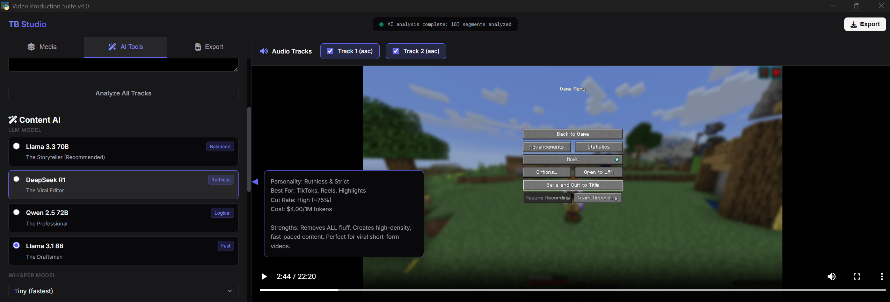
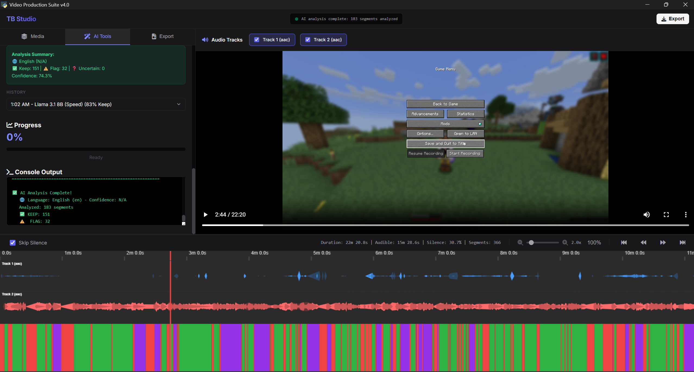
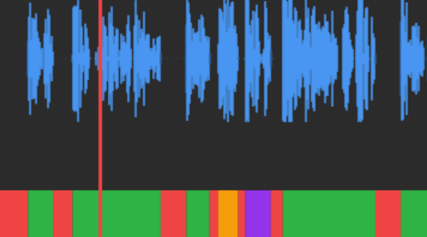

# TooBoooring Studio 1.0

> Professional video editing application with AI-powered content analysis, silence detection, and GPU-accelerated encoding

[](https://www.python.org/downloads/)
[](LICENSE)
[](https://github.com/tooboooring/video_production_by_tooboooring)

**Repository**: [https://github.com/tooboooring/video_production_by_tooboooring](https://github.com/tooboooring/video_production_by_tooboooring)

---

## Table of Contents

- [Features](#features)
- [Screenshots](#screenshots)
- [Installation](#installation)
- [Quick Start](#quick-start)
- [Configuration](#configuration)
- [Usage Guide](#usage-guide)
- [Project Structure](#project-structure)
- [Requirements](#requirements)
- [Contributing](#contributing)
- [License](#license)
- [Upcoming Features](#upcoming-features)

---

## Features

### Core Video Processing
- **Silence Detection & Removal**: Advanced silence detection with customizable thresholds and duration settings
- **Video Trimming**: Frame-accurate video cutting with multi-segment support
- **GPU-Accelerated Encoding**: Hardware acceleration support for NVIDIA (NVENC), AMD (AMF), Intel (Quick Sync), and CPU encoding
- **Enhanced Timeline**: Smooth waveform visualization with color-coded segments for precise editing
- **Frame-Accurate Preview**: Preview video frames at exact timestamps with FFplay integration
- **Multi-Track Audio Mixer**: Listen to all audio tracks simultaneously with toggle controls - works with any language (Hindi, English, etc.)
- **Drag & Drop**: Simple drag and drop interface for quick video loading
- **Project Save/Load**: Save your editing sessions to .tbproj files and resume later with all segments, settings, and AI analysis history preserved

### AI-Powered Content Analysis
- **AI Content Analysis**: Intelligent content evaluation using OpenAI Whisper and together.ai
- **Automatic Transcription**: Local audio transcription with word-level timestamps (cached for performance)
- **Context-Aware Analysis**: AI analyzes content with surrounding context for better decisions
- **Visual Feedback**: Color-coded segments (green=keep, orange=flag) based on AI recommendations
- **Export Analysis**: Save AI decisions and reasoning to JSON for review
- **Analysis History**: Toggle between different AI analysis runs without re-analyzing
- **Model Tooltips**: Hover over AI models to see detailed information (personality, use cases, cut rates)
- **Multiple AI Models**: Choose from 4 specialized models optimized for different content types

### User Interface
- **Modern Web UI**: Professional three-panel layout with PyWebView for cross-platform compatibility
- **Tabbed Navigation**: Organized workspace with Media, AI Tools, and Export tabs
- **Dark Theme**: Sleek, modern zinc/slate dark theme with indigo accents optimized for video editing
- **Audio Track Mixer**: Listen to all audio tracks simultaneously with toggle controls
- **Drag & Drop**: Simple drag and drop video loading for quick workflow
- **Keyboard Shortcuts**: Efficient workflow with keyboard navigation (Ctrl+S to save, Ctrl+O to open)
- **Enhanced Timeline**: Smooth waveform rendering with improved visual feedback
- **Cost Estimation**: Real-time cost and token count estimates before running AI analysis
- **Advanced Tooltips**: Hover over AI models to see detailed personality, use cases, and cut rates
- **Auto-Save**: Automatic project saves every 5 minutes to prevent data loss

### Advanced Features
- **Advanced Settings**: Fine-tune silence detection, padding, and encoding parameters
- **Settings Persistence**: Save and restore your preferred settings
- **Progress Tracking**: Real-time progress updates during video processing
- **Audio Analysis**: Detailed audio track analysis and visualization

---

## What's New

### Latest Updates

**UI Redesign:**
- **Modern Three-Panel Layout**: Professional workspace with left sidebar, center video player, and bottom timeline
- **Tabbed Navigation**: Organized tabs for Media, AI Tools, and Export
- **TB Studio Branding**: Updated branding with modern logo and color scheme
- **Dark Theme**: Beautiful zinc/slate dark theme with indigo accents
- **Drag & Drop**: Simply drag video files into the app to load them
- **Audio Track Mixer**: Multi-track audio support - listen to all tracks simultaneously with toggle controls
- **Enhanced Timeline**: Smooth waveform rendering with better visual clarity
- **Streamlined UI**: Removed non-functional components for a cleaner, more focused interface
- **Advanced Tooltips**: Rich tooltips showing AI model personality, best use cases, and cut rates

**Project Management:**
- **Project Save/Load**: Save your editing sessions to .tbproj files with all segments, settings, and AI analysis
- **Auto-Save**: Automatic background saves every 5 minutes to prevent data loss
- **Keyboard Shortcuts**: Ctrl+S to save, Ctrl+O to open projects quickly
- **Beautiful Notifications**: Modern toast notifications and modal dialogs for user feedback
- **Video Path Tracking**: Projects remember video file paths for easy restoration

**AI Analysis Improvements:**
- **DeepSeek R1 Support**: Fixed token starvation issues - DeepSeek R1 now works correctly with proper reasoning
- **Analysis History**: Compare different AI runs instantly - toggle between models without re-analyzing
- **Enhanced Model Selection**: 4 specialized models optimized for different content types:
  - **Llama 3.3 70B (Recommended)**: The Storyteller - Low cut rate (~5%), best for vlogs and tutorials
  - **DeepSeek R1 (Ruthless)**: The Viral Editor - High cut rate (~75%), perfect for TikToks and reels
  - **Qwen 2.5 72B (Balanced)**: The Professional - Medium cut rate (~15%), ideal for corporate/educational content
  - **Llama 3.1 8B (Speed)**: The Draftsman - Fast and cheap, great for quick tests

**Reliability Improvements:**
- **Robust Error Handling**: Enhanced retry logic with exponential backoff for rate limits (429 errors)
- **Fail-Fast Validation**: API key and connection validation before starting analysis (saves time)
- **Improved Timeouts**: Increased timeouts for verbose models like DeepSeek R1 (120s)
- **Better Logging**: Comprehensive debug logging for troubleshooting

---

## Screenshots







---

## Installation

### Prerequisites

- **Python 3.8 or higher**
- **FFmpeg** (included in `video_production_app/bin/` or install system-wide)
- **Git** (for cloning the repository)

### Step-by-Step Installation

1. **Clone the repository**:
   ```bash
   git clone https://github.com/tooboooring/video_production_by_tooboooring.git
   cd video_production_by_tooboooring
   ```

2. **Create a virtual environment** (recommended):
   ```bash
   # Windows
   python -m venv .venv
   .venv\Scripts\activate

   # macOS/Linux
   python3 -m venv .venv
   source .venv/bin/activate
   ```

3. **Install dependencies**:
   ```bash
   pip install -r requirements.txt
   ```

4. **Verify FFmpeg installation**:
   - FFmpeg executables are included in `video_production_app/bin/`
   - Or ensure FFmpeg is in your system PATH
   - Test with: `ffmpeg -version`

### Optional: AI Analysis Setup

For AI-powered content analysis features:

1. **Get a together.ai API key**:
   - Sign up at [https://together.ai](https://together.ai)
   - Create an API key from your dashboard

2. **Configure API key** (choose one method):
   - **Option A**: Enter in UI settings panel (most secure)
   - **Option B**: Create `.env` file in project root:
     ```bash
     TOGETHER_API_KEY=your_api_key_here
     ```
   - **Option C**: Set system environment variable:
     ```bash
     # Windows
     setx TOGETHER_API_KEY "your_api_key_here"
     
     # macOS/Linux
     export TOGETHER_API_KEY="your_api_key_here"
     ```

---

## Quick Start

### Launch the Application

**Option 1: Interactive Launcher** (Recommended)
```bash
python -m video_production_app.launcher
```

**Option 2: Direct Launch**
```bash
# Launch Web UI directly
python -m video_production_app.web.launcher
```

**Option 3: Using Launcher**
```bash
# Launch via launcher (same as Option 1)
python -m video_production_app.launcher.launcher
```

### Basic Workflow

1. **Load Video**: Click "Load Video" or drag & drop a video file into the upload zone
2. **Audio Mixer**: Toggle audio tracks on/off to hear multiple tracks simultaneously (if applicable)
3. **Select Audio Track**: Navigate to the AI Tools tab and choose the audio track to analyze
4. **Detect Silence**: Click "Detect Silence" to identify silent segments
5. **Review Timeline**: Check the smooth waveform visualization and color-coded segments
6. **Optional - AI Analysis**: Run AI analysis to get intelligent content recommendations
7. **Save Project** (Optional): Click "Save" in the header to save your work (Ctrl+S)
8. **Export Video**: Navigate to the Export tab and click "Export Video" to render the final video

### Project Management

- **Save Project**: Click "Save" button in header or press Ctrl+S to save your editing session
- **Open Project**: Click "Open" button in header or press Ctrl+O to resume a saved project
- **Auto-Save**: Projects are automatically saved every 5 minutes in the same folder as your video
- **Project Files**: Saved as `.tbproj` files containing segments, settings, AI analysis history, and video metadata

---

## Configuration

### Silence Detection Settings

Customize silence detection parameters in the Advanced Settings tab:

- **Silence Threshold (dB)**: Volume level to consider as silence (default: -40 dB)
- **Silence Duration (s)**: Minimum duration to detect as silence (default: 0.7s)
- **Padding Before (s)**: Time to keep before silence (default: 0.1s)
- **Padding After (s)**: Time to keep after silence (default: 0.0s)

### Encoder Selection

Choose from multiple encoding options:

- **NVIDIA (H.264/HEVC)**: Hardware acceleration with NVENC (requires NVIDIA GPU)
- **AMD (H.264/HEVC)**: Hardware acceleration with AMF (requires AMD GPU)
- **Intel (H.264/HEVC)**: Hardware acceleration with Quick Sync (requires Intel GPU)
- **CPU (x264)**: Software encoding (works on any system, slower)
- **Automatic**: Automatically selects the best available GPU encoder

### AI Analysis Configuration

Configure AI analysis in the settings:

- **Whisper Model**: Choose transcription quality (tiny/base/small/medium/large)
  - `tiny`: Fastest, lower accuracy (~1GB VRAM)
  - `base`: Good balance, recommended (~1GB VRAM)
  - `small`: Better accuracy (~2GB VRAM)
  - `medium`: Very good accuracy (~5GB VRAM)
  - `large`: Best accuracy, slowest (~10GB VRAM)
- **Context Window**: Seconds before/after each segment to include (default: 30s)
- **AI Model**: Choose from 4 specialized models (hover for tooltip):
  - **Llama 3.3 70B (Recommended)**: Default, best overall balance
  - **DeepSeek R1 (Ruthless)**: High-density cuts, perfect for short-form content
  - **Qwen 2.5 72B (Balanced)**: Professional, logical analysis
  - **Llama 3.1 8B (Speed)**: Fast and cheap for quick tests

---

## Usage Guide

### Understanding the Interface

The **TB Studio** interface is organized into a modern three-panel layout:

**Top Section:**
- **Header Bar**: Shows app branding, system status, and quick export button
- **Left Sidebar (480px)**: Tabbed navigation with three main sections:
  - **Media Tab**: Video loading, drag & drop zone
  - **AI Tools Tab**: Silence detection, AI analysis, transcription settings
  - **Export Tab**: Encoding options, format selection, render queue
- **Center Panel**: Video player with audio track mixer (when applicable)
- **Bottom Panel**: Interactive timeline with:
  - Time ruler
  - Multi-track waveform visualization
  - Color-coded segments (green/red/orange)
  - Zoom and scroll controls

### Main Workflow

1. **Load Video**
   - **Method A**: Click "Load Video" button in the Media tab
   - **Method B**: Drag & drop a video file into the upload zone
   - Supported formats: .mp4, .avi, .mov, .mkv, .wmv, .flv, .webm, .m4v
   - Video information will be displayed in the header

2. **Multi-Track Audio** (If applicable)
   - Audio track mixer appears above the video player
   - Toggle checkboxes to enable/disable tracks
   - Listen to all enabled tracks mixed in real-time
   - Works with any language (Hindi, English, etc.)

3. **Detect Silence**
   - Navigate to the **AI Tools** tab
   - Select the audio track to analyze from the dropdown
   - Adjust silence detection parameters if needed
   - Click "Detect Silence"
   - Review segments on the enhanced timeline:
     - Green = audible segments
     - Gray = silent segments
     - Smooth waveform visualization

4. **AI Analysis** (Optional)
   - Stay in the **AI Tools** tab
   - Enter your together.ai API key (saved securely in browser)
   - Select AI model (hover for detailed tooltip showing personality and cut rates)
   - Select Whisper model for transcription quality
   - View real-time cost estimate
   - Click "Run AI Analysis"
   - Wait for transcription and analysis
   - Review AI recommendations:
     - Green = keep segments
     - Red = remove segments (silence)
     - Orange/Purple = AI flagged segments
   - **Toggle History**: Use the History dropdown to compare different AI runs instantly

5. **Manual Editing**
   - Click segments on timeline to toggle keep/remove status
   - Zoom in/out using timeline controls
   - Scroll through long videos
   - Use frame preview to check exact timestamps

6. **Export Video**
   - Navigate to the **Export** tab
   - Choose encoder (GPU or CPU)
   - Select output format (MP4, MOV)
   - Set trim points if needed
   - Click "Export Video"
   - Monitor progress in real-time
   - Additional exports: Cuts list, EDL, XML

### Keyboard Shortcuts

- **Space**: Play/Pause preview
- **Arrow Keys**: Navigate timeline
- **Mouse Wheel**: Zoom timeline
- **Click Segment**: Toggle keep/remove
- **Ctrl+S** (or **Cmd+S**): Save project
- **Ctrl+O** (or **Cmd+O**): Open project
- **Ctrl+Shift+S**: Save project as (shows dialog)

---

## Project Structure

```
video_production_app/
├── __init__.py                 # Package initialization
├── config.py                   # Configuration constants
│
├── launcher/                   # Main launcher module
│   └── launcher.py             # Main entry point
│
├── web/                        # Web UI package
│   ├── launcher.py             # Web UI entry point
│   ├── web_main.py             # PyWebView backend API
│   └── web_ui/                 # Frontend files
│       ├── index.html          # Main HTML
│       ├── main.js             # Main JavaScript logic
│       ├── player.js           # Video player controls
│       ├── timeline.js         # Timeline visualization
│       └── style.css           # Stylesheet
│
├── core/                       # Core business logic
│   ├── ffmpeg_wrapper.py       # FFmpeg/FFprobe operations
│   ├── silence_detector.py     # Silence detection logic
│   ├── video_processor.py      # Video processing logic
│   ├── settings_manager.py     # Settings persistence
│   └── project_manager.py      # Project save/load functionality
│
├── ai_analysis/                # AI content analysis
│   ├── transcriber.py          # Whisper transcription
│   ├── context_builder.py      # Context extraction
│   ├── ai_analyzer.py          # together.ai integration
│   └── orchestrator.py         # Analysis pipeline
│
├── utils/                      # Utility functions
│   ├── colors.py               # Color theme definitions
│   ├── entry_helpers.py         # Entry point helpers
│   ├── helpers.py              # Helper functions
│   ├── logger.py               # Logging configuration
│   ├── validators.py           # Input validation
│   └── waveform.py             # Waveform generator
│
└── bin/                        # Binary executables
    ├── ffmpeg.exe              # FFmpeg executable
    ├── ffprobe.exe             # FFprobe executable
    └── ffplay.exe              # FFplay executable
```

---

## Requirements

### Core Dependencies

- **pywebview** >= 4.0.0 - Web UI framework
- **numpy** >= 1.24.0 - Numerical operations

### AI Analysis Dependencies (Optional)

- **openai-whisper** >= 20231117 - Local audio transcription
- **requests** >= 2.31.0 - HTTP requests for together.ai API
- **pydantic** >= 2.5.0 - Structured data validation

### System Requirements

- **Python**: 3.8 or higher
- **FFmpeg**: Included in `bin/` folder or system installation
- **RAM**: 4GB minimum, 8GB recommended
- **GPU**: Optional but recommended for hardware acceleration
- **Storage**: ~500MB for application + dependencies

### Optional Dependencies

- **python-dotenv** - For `.env` file support
- **torch** - GPU acceleration for Whisper (auto-installed with Whisper)
- **opencv-python** - Enhanced frame preview features
- **librosa** - Advanced audio analysis

---

## Contributing

Contributions are welcome! This project follows best practices for maintainability and code organization.

### Development Setup

1. **Fork the repository**
2. **Create a feature branch**:
   ```bash
   git checkout -b feature/your-feature-name
   ```
3. **Set up development environment**:
   ```bash
   python -m venv .venv
   source .venv/bin/activate  # or .venv\Scripts\activate on Windows
   pip install -r requirements.txt
   ```
4. **Make your changes** following the existing code structure
5. **Test your changes** thoroughly
6. **Submit a pull request**

### Code Structure Guidelines

- **Separation of Concerns**: UI, business logic, and utilities are separated
- **Module Organization**: Each module has a clear responsibility
- **Documentation**: All functions include comprehensive docstrings
- **Type Hints**: Use type hints for better code clarity
- **Error Handling**: Implement proper error handling and user feedback

### Areas for Contribution

- Bug fixes and improvements
- New features and enhancements
- Documentation improvements
- Performance optimizations
- UI/UX improvements
- Test coverage

---

## License

This project is licensed under the Apache License 2.0 - see the [LICENSE](LICENSE) file for details.

Copyright 2024 Shankargouda Hanchinal

---

## Upcoming Features

### Planned Enhancements

#### AI Analysis
- [ ] **Custom Prompt Templates**: User-defined AI analysis prompts
- [ ] **Persistent History**: Save analysis history to disk (currently session-only)
- [ ] **Model Comparison**: Side-by-side comparison of different model results
- [ ] **Ensemble Analysis**: Combine decisions from multiple AI models

#### Video Processing
- [ ] **Batch Processing**: Process multiple videos in a queue with progress tracking
- [ ] **Subtitle Support**: Import and export SRT subtitle files
- [x] **Audio Mixing**: Mix multiple audio tracks with toggle controls - *Implemented*
- [x] **Project Save/Load**: Save and restore editing sessions - *Implemented*
- [ ] **Multi-format Export**: Support for additional video formats and codecs

#### User Interface
- [x] **Dark Theme**: Professional zinc/slate dark theme - *Implemented*
- [ ] **Light Theme**: Optional light theme for daytime use
- [ ] **Customizable Layout**: Resizable and rearrangeable UI panels
- [ ] **Undo/Redo System**: Full undo/redo functionality for edits

#### Performance & Optimization
- [ ] **GPU Acceleration for Whisper**: CUDA support for faster transcription
- [ ] **Parallel Processing**: Process multiple videos simultaneously
- [ ] **Progress Resume**: Resume interrupted processing tasks

### Feature Requests

We welcome feature requests from the community! If you have an idea for a feature:

1. **Check existing issues**: Search for similar feature requests
2. **Create an issue**: Open a new issue with the `enhancement` label
3. **Provide details**: Describe the feature, use cases, and potential implementation
4. **Community feedback**: Engage with other users' suggestions

---

## Acknowledgments

- **FFmpeg**: Video processing capabilities
- **OpenAI Whisper**: Speech recognition and transcription
- **together.ai**: AI content analysis
- **PyWebView**: Web UI framework

---

**Made with love by the Tooboooring (Shankargouda Hanchinal)**

For questions, issues, or contributions, please visit the [GitHub repository](https://github.com/tooboooring/video_production_by_tooboooring).

---

## WARNING

**VIBE-CODED WARNING**: This codebase was developed with a focus on rapid iteration and functionality over strict code conventions. While the application is functional and tested, the code may contain:

- Inconsistent coding styles and patterns
- Experimental implementations that may need refactoring
- Code that works but may not follow all best practices
- Areas that could benefit from optimization or cleanup

**Use at your own discretion**. This is a working application, but contributors should be aware that some parts of the codebase may require additional polish and standardization. When contributing, please maintain consistency with the existing code style in each module.

**For Production Use**: While functional, this software is provided as-is. Always backup your work and test thoroughly before using in production environments.
